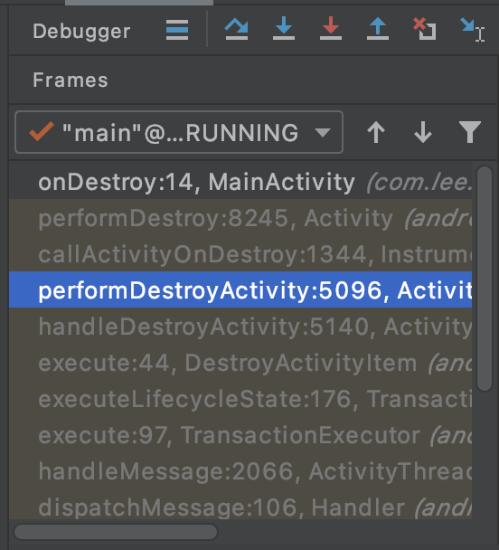

# Jetpack —— ViewModel 篇

## 前言

`ViewModel` 是 Jetpack 的核心组件之一。简单地顾名思义，它充当 MVVM 模式中的 VM 层。当然它的作用远不止如此。

本文主要按以下几点展开讨论

+ `ViewModel` 解决痛点
+ `ViewModel` 依赖引用
+ `ViewModel` 用法示例
+ `ViewModel` 源码浅析

## `ViewModel` 主要解决的痛点：

**数据持久化**

如果没有在 manifest 文件中为 Activity 配置 `configChanges` , 则当发生配置改变如旋转屏幕或更换系统语言等操作，会导致 Activity 重建，所以视图绑定的数据就丢失了。这个问题普通的 ViewModel 就可以解决。

另外一种情况是当应用退到后台，由于资源紧张内存不足导致进程被杀，这时用户再回到该应用，Activity 也会重建。这个需要用到带 `SavedStateHandle` 的 ViewModel ，下文会有示例。

**Fragment 间共享数据**

通常 Fragment 之间共享数据需要借助共同的父 Activity ，以接口的方式调用。这样无疑会加大 Fragment 和 Activity 耦合度。 当然 `ViewModel` 用于 Fragment 之间数据共享也是基于共同的 Activity ，但是 `ViewModel` 框架已经为我们做了很多工作，我们可以不再需要写接口。

**数据和视图解耦**

从界面控制器逻辑中分离出视图数据可以达到很好解耦效果，同时也试单元测试更易行且更高效。

## 引用

在 gradle 文件中加入相关依赖。

```
dependencies {
    // 最新版本号
    def lifecycle_version = "2.2.0"

    // ViewModel
    implementation "androidx.lifecycle:lifecycle-extensions:$lifecycle_version"

    // 可选 - Saved state module for ViewModel
    implementation "androidx.lifecycle:lifecycle-viewmodel-savedstate:$lifecycle_version"

    // 推荐 - activity-ktx 和 fragment-ktx 可代替上面两个
    implementation 'androidx.activity:activity-ktx:1.1.0'
    implementation 'androidx.fragment:fragment-ktx:1.2.5'
}
```

## 示例

先自定义一个普通的 `ViewModel` 。
```
class MyViewModel : ViewModel() {
    private val _count = MutableLiveData<Int>()

    val count = _count

    fun add() {
        count.value?.plus(1)
    }
}
```

再定义一个带 `SavedStateHandle` 的 `ViewModel` 。
```
class MySavedStateViewModel(private val savedStateHandle: SavedStateHandle) : ViewModel() {
    private val key = "key"

    val count = savedStateHandle.getLiveData<Int>(key)

    fun add() {
        savedStateHandle[key] = (count.value ?: 0) + 1
    }
}
```

在 Activity 中使用
```
class MyActivity : AppCompatActivity() {

    /**
     * 这里初始化用了 activity-ktx 的委托属性，原始的初始化需要使用 ViewModelProvider
     * 因为 AppCompatActivity 和 viewModels 默认的 ViewModelProvider.Factory 都是
     * SavedStateViewModelFactory，所以创建 SavedStateViewModel 不用自己再传
     */
    private val viewModel by viewModels<MyViewModel>()
    private val savedStateViewModel by viewModels<MySavedStateViewModel>()
    private var count = 0

    override fun onCreate(savedInstanceState: Bundle?) {
        super.onCreate(savedInstanceState)
        setContentView(R.layout.activity_main)
        viewModel.count.observe(this) {
            text1.text = "$it"
        }
        savedStateViewModel.count.observe(this) {
            text2.text = "$it"
        }
        fab.setOnClickListener {
            viewModel.add()
            savedStateViewModel.add()
            add()
        }
    }

    private fun add() {
        text0.text = "${++count}"
    }
}
```

上面示例的代码分别用三个 `TextView` 来显示计数，为了模拟应用在后台会杀死的情境，可以在开发者选项里面打开 “不保留活动” 这个开关。下面三个截图分别对应启动后点击四次增加按钮后、旋转屏幕后和退出应用再回来的情况。


在 Fragment 之间共享数据
```
class SharedViewModel : ViewModel() {
    val selected = MutableLiveData<Item>()

    fun select(item: Item) {
        selected.value = item
    }
}

class MasterFragment : Fragment() {

    private lateinit var itemSelector: Selector

    private val model: SharedViewModel by activityViewModels()

    override fun onViewCreated(view: View, savedInstanceState: Bundle?) {
        super.onViewCreated(view, savedInstanceState)
        itemSelector.setOnClickListener { item ->
            // Update the UI
        }
    }
}

class DetailFragment : Fragment() {

    private val model: SharedViewModel by activityViewModels()

    override fun onViewCreated(view: View, savedInstanceState: Bundle?) {
        super.onViewCreated(view, savedInstanceState)
        model.selected.observe(viewLifecycleOwner, Observer<Item> { item ->
            // Update the UI
        })
    }
}
```

在 Lifecycle 的 2.1.0 版本后加入了 `viewModelScope` 以更方便地支持在 `ViewModel` 中使用协程；另外 `ViewModel` 还可以结合 `data-binding` 和 NavGraph 使用，具体可以参考 [知识点 | ViewModel 四种集成方式](https://shenzhen2017.github.io/blog/2020/10/viewmodel-sum-up.html#more) ，本文不再赘述。

## 源码浅析

在分析源码之前，我们先思考这几个问题

1. `ViewModel` 是怎么在 `Fragment` 之间共享数据的？
2. `ViewModel` 在配置改变时是如何保存和恢复数据的？
3. `ViewModel` 在进程被杀死时是如何保存和恢复数据的？

带着这些问题我们逐步深入源码。首先从 `ViewModel` 的创建入开始。`ViewModel` 的创建均是由 `ViewModelProvider` 提供的，所以先看下 `ViewModelProvider` 的构造函数。
```
public class ViewModelProvider {
    ...

    public ViewModelProvider(@NonNull ViewModelStoreOwner owner) {
        this(owner.getViewModelStore(), owner instanceof HasDefaultViewModelProviderFactory
                ? ((HasDefaultViewModelProviderFactory) owner).getDefaultViewModelProviderFactory()
                : NewInstanceFactory.getInstance());
    }
    
    public ViewModelProvider(@NonNull ViewModelStoreOwner owner, @NonNull Factory factory) {
        this(owner.getViewModelStore(), factory);
    }

    public ViewModelProvider(@NonNull ViewModelStore store, @NonNull Factory factory) {
        mFactory = factory;
        mViewModelStore = store;
    }

    ...
}
```
从构造函数中可以看出需要传入 `ViewModelStore` / `ViewModelStoreOwner` 和 `Factory` 。其中 `Factory` 是一个接口，如下
```
public interface Factory {
    @NonNull
    <T extends ViewModel> T create(@NonNull Class<T> modelClass);
}
```
这里我们先了解 `ViewModel` 实例是由 `Factory` 的实现类创建的，在源码中有 `AndroidViewModelFactory` 和 `SavedStateModelFactory` 这些实现类，基本都是通过反射来生成，具体细节暂不深入。

重点关注第一个参数 `ViewModelStore` / `ViewModelStoreOwner` ，其中 `ViewModelStoreOwner` 也是个接口，如下
```
public interface ViewModelStoreOwner {
    @NonNull
    ViewModelStore getViewModelStore();
}
```
它提供了 `ViewModelStore` 的获取方法，也即间接提供了 `ViewModelStore` 。`ComponentActivity` 和 `Fragment` 就实现了 `ViewModelStoreOwner` 这个接口：
```
// ComponentActivity 是 FragmentActivity 的基类，而 FragmentActivity 是常用的 AppCompatActivity 的基类
public class ComponentActivity extends androidx.core.app.ComponentActivity implements
        LifecycleOwner,
        ViewModelStoreOwner,
        HasDefaultViewModelProviderFactory,
        SavedStateRegistryOwner,
        OnBackPressedDispatcherOwner {
    ...

    @NonNull
    @Override
    public ViewModelStore getViewModelStore() {
        if (getApplication() == null) {
            throw new IllegalStateException("Your activity is not yet attached to the "
                    + "Application instance. You can't request ViewModel before onCreate call.");
        }
        if (mViewModelStore == null) {
            NonConfigurationInstances nc =
                    (NonConfigurationInstances) getLastNonConfigurationInstance();
            if (nc != null) {
                // Restore the ViewModelStore from NonConfigurationInstances
                mViewModelStore = nc.viewModelStore;
            }
            if (mViewModelStore == null) {
                mViewModelStore = new ViewModelStore();
            }
        }
        return mViewModelStore;
    }

    ...
}

// Fragment
public class Fragment implements ComponentCallbacks, OnCreateContextMenuListener, LifecycleOwner,
        ViewModelStoreOwner, SavedStateRegistryOwner {
    ...

    @NonNull
    @Override
    public ViewModelStore getViewModelStore() {
        if (mFragmentManager == null) {
            throw new IllegalStateException("Can't access ViewModels from detached fragment");
        }
        return mFragmentManager.getViewModelStore(this);
    }

    ...
}
```
有兴趣的读者可以跟进 `FragmentManager` 源码看一下, `mFragmentManager` 维护了一个 `FragmentManagerViewModel`，`FragmentManagerViewModel` 里面有一个 `HashMap` ，创建并存放各个 Fragment 的 `ViewModelStore` 。而这个 `FragmentManagerViewModel` 会放进 Activity 的 `ViewModelStore` 里。

那么 `ViewModelStore` 是个什么呢？为什创建 `ViewModel` 需要它呢？不妨进一步看下它的源码
```
public class ViewModelStore {

    private final HashMap<String, ViewModel> mMap = new HashMap<>();

    final void put(String key, ViewModel viewModel) {
        ViewModel oldViewModel = mMap.put(key, viewModel);
        if (oldViewModel != null) {
            oldViewModel.onCleared();
        }
    }

    final ViewModel get(String key) {
        return mMap.get(key);
    }

    Set<String> keys() {
        return new HashSet<>(mMap.keySet());
    }

    /**
     *  Clears internal storage and notifies ViewModels that they are no longer used.
     */
    public final void clear() {
        for (ViewModel vm : mMap.values()) {
            vm.clear();
        }
        mMap.clear();
    }
}
```
它维护的是一个 `HashMap<String, ViewModel>` ，可以推断出 Activity 和 Fragment 创建和使用的 `ViewModel` 是存在这个 map 里面的。

既然是 `HashMap` 结构，那么在存取的时候就需要一个 key ，这个 key 是在哪里传进去的呢？让我们把焦点转移到 `ViewModelProvider` 获取 `ViewModel` 的 get 方法
```
public class ViewModelProvider {

    private static final String DEFAULT_KEY =
            "androidx.lifecycle.ViewModelProvider.DefaultKey";
    ...

    @NonNull
    @MainThread
    public <T extends ViewModel> T get(@NonNull Class<T> modelClass) {
        String canonicalName = modelClass.getCanonicalName();
        if (canonicalName == null) {
            throw new IllegalArgumentException("Local and anonymous classes can not be ViewModels");
        }
        return get(DEFAULT_KEY + ":" + canonicalName, modelClass);
    }

    @NonNull
    @MainThread
    public <T extends ViewModel> T get(@NonNull String key, @NonNull Class<T> modelClass) {
        ViewModel viewModel = mViewModelStore.get(key);

        if (modelClass.isInstance(viewModel)) {
            if (mFactory instanceof OnRequeryFactory) {
                ((OnRequeryFactory) mFactory).onRequery(viewModel);
            }
            return (T) viewModel;
        } else {
            //noinspection StatementWithEmptyBody
            if (viewModel != null) {
                // TODO: log a warning.
            }
        }
        if (mFactory instanceof KeyedFactory) {
            viewModel = ((KeyedFactory) (mFactory)).create(key, modelClass);
        } else {
            viewModel = (mFactory).create(modelClass);
        }
        mViewModelStore.put(key, viewModel);
        return (T) viewModel;
    }

    ...
```
可知 key 正是在 `get` 方法传进去的，当调用没有 key 传参的方法时，系统会自动帮你生成一个默认 key ，规则是 `DEFAULT_KEY + ':' + ViewModel 类名` 。

我们通常使用的是不传 key 的方法，这里有一个地方需要注意的地方。因为上文提到 `ViewModelStore` 内部是一个 `HashMap` ，所以当我们使用默认 key 生成同类型的 `ViewModel` 时候，获取到的会是同一个 `ViewModel` 。

举个例子，比如你在一个 Activity 中声明了两个类型一样的 `ViewModel` 并通过 `ViewModelProvider(this).get(xxx.class)` 的方式初始化，你会发现两个 `ViewModel` 的地址是一样的。由此，我们可以推断出 `ViewModel` 可以在 Fragment 之间共享数据，前提是他们归属同一个 Activity 的原因。

当我们需要在 Fragment 之间共享 `ViewModel` 时，在初始化会使用它们的 Activity 作为入参来创建 `ViewModelProvider(requireActivity()).get(xxx.class)` ， 这样得到的是就同一个 `ViewModel` 。至此，问题一得到解决。

接下来看问题二。在此之前，读者可以回想一下上文关于 `ViewModelStore` 的获取过程。

```
if (mViewModelStore == null) {
    NonConfigurationInstances nc =
                    (NonConfigurationInstances) getLastNonConfigurationInstance();
    if (nc != null) {
        // Restore the ViewModelStore from NonConfigurationInstances
        mViewModelStore = nc.viewModelStore;
    }
    if (mViewModelStore == null) {
        mViewModelStore = new ViewModelStore();
    }
}
```

首先先判断是否已经初始化，如果没有接着从一个 `NonConfigurationInstances` 的实例获取，如果还是空再 new 一个。其中 `NonConfigurationInstances` 正是问题的关键。

**`ComponentActivity.NonConfigurationInstances`**

```
static final class NonConfigurationInstances {
    Object custom;
    ViewModelStore viewModelStore;
}
```

`NonConfigurationInstances` 的实例是从哪里来的？跟踪 `getLastNonConfigurationInstance()` 方法，它来到了基类 Activity

```
/**
 * Retrieve the non-configuration instance data that was previously
 * returned by {@link #onRetainNonConfigurationInstance()}.  
 */
@Nullable
public Object getLastNonConfigurationInstance() {
    return mLastNonConfigurationInstances != null
            ? mLastNonConfigurationInstances.activity : null;
}
```

这里明明返回的是 `mLastNonConfigurationInstances.activity` ，为什么注释里说是从之前的 `onRetainNonConfigurationInstance()` 中得到的？稍安勿躁，让我们一步步跟踪系统调用流程，就会发现注释为什么这样说了。

首先我们看一下这个 `mLastNonConfigurationInstances` 是在哪里赋值的。 从 Activity 的源码里搜索了一下，发现是在 `attach` 方法里：

```
@UnsupportedAppUsage
final void attach(Context context, ActivityThread aThread,
        Instrumentation instr, IBinder token, int ident,
        Application application, Intent intent, ActivityInfo info,
        CharSequence title, Activity parent, String id,
        NonConfigurationInstances lastNonConfigurationInstances,
        Configuration config, String referrer, IVoiceInteractor voiceInteractor,
        Window window, ActivityConfigCallback activityConfigCallback, IBinder assistToken) {
    attachBaseContext(context);
    ...
    mLastNonConfigurationInstances = lastNonConfigurationInstances;
    ...
}
```

那么，又是哪里调用了 `attach` 呢？（问题太深，是不是有点想放弃了😂……）这就要翻一下系统源码 ActivityThread 了。

```
public final class ActivityThread extends ClientTransactionHandler {

    private Activity performLaunchActivity(ActivityClientRecord r, Intent customIntent) {
        
        ...
        
        activity.attach(appContext, this, getInstrumentation(), r.token,
                r.ident, app, r.intent, r.activityInfo, title, r.parent,
                r.embeddedID, r.lastNonConfigurationInstances, config,
                r.referrer, r.voiceInteractor, window, r.configCallback,
                r.assistToken);

    }

}
```
从这里可以看到是从 `performLaunchActivity` 方法中调用的。好了，知道了 `mLastNonConfigurationInstances` 是什么时候被赋值的，但知道这个值是是从哪里来的。

读者不妨先思考一下，当配置发生改变时，原 Activity 会被销毁然后重新创建一个新的实例，所以我们可以从 Activity 的 `onDestroy` 方法切入。这里 debug 看看调用堆栈



所以再次回到 ActivityThread 这个类

```
public final class ActivityThread extends ClientTransactionHandler {

    ...

    ActivityClientRecord performDestroyActivity(
        IBinder token, boolean finishing,
        int configChanges, 
        boolean getNonConfigInstance, 
        String reason) {
            
        ...
        
        ActivityClientRecord r = mActivities.get(token);
        
        if (getNonConfigInstance) {
            try {
                r.lastNonConfigurationInstances
                        = r.activity.retainNonConfigurationInstances();
            } catch (Exception e) {
                if (!mInstrumentation.onException(r.activity, e)) {
                    throw new RuntimeException(
                            "Unable to retain activity "
                            + r.intent.getComponent().toShortString()
                            + ": " + e.toString(), e);
                }
            }
        }
        
        return r;
    }
}
```

到这里就很明确了，在 Activity 销毁时调用了

```
NonConfigurationInstances retainNonConfigurationInstances() {
    Object activity = onRetainNonConfigurationInstance();
    ...
    NonConfigurationInstances nci = new NonConfigurationInstances();
    nci.activity = activity;
    ...
    return nci;
}
```

这里实际就是调用了刚刚注释说的 `onRetainNonConfigurationInstance()` ，保存 `activity` 实例（这里的 `activity` 不是指 Activity 本身，要看具体返回的对象）。以 `ComponentActivity` 为例

```
@Override
@Nullable
public final Object onRetainNonConfigurationInstance() {
    Object custom = onRetainCustomNonConfigurationInstance();

    ViewModelStore viewModelStore = mViewModelStore;
    if (viewModelStore == null) {
        // No one called getViewModelStore(), so see if there was an existing
        // ViewModelStore from our last NonConfigurationInstance
        NonConfigurationInstances nc =
            (NonConfigurationInstances) getLastNonConfigurationInstance();
        if (nc != null) {
            viewModelStore = nc.viewModelStore;
        }
    }

    if (viewModelStore == null && custom == null) {
        return null;
    }

    NonConfigurationInstances nci = new NonConfigurationInstances();
    nci.custom = custom;
    nci.viewModelStore = viewModelStore;
    return nci;
}
```

这里关键就是就保存 `ViewModelStore` 示例。这样当原来 Activity 销毁重新创建拿到的 `ViewModelStore` 就是同一个对象了。